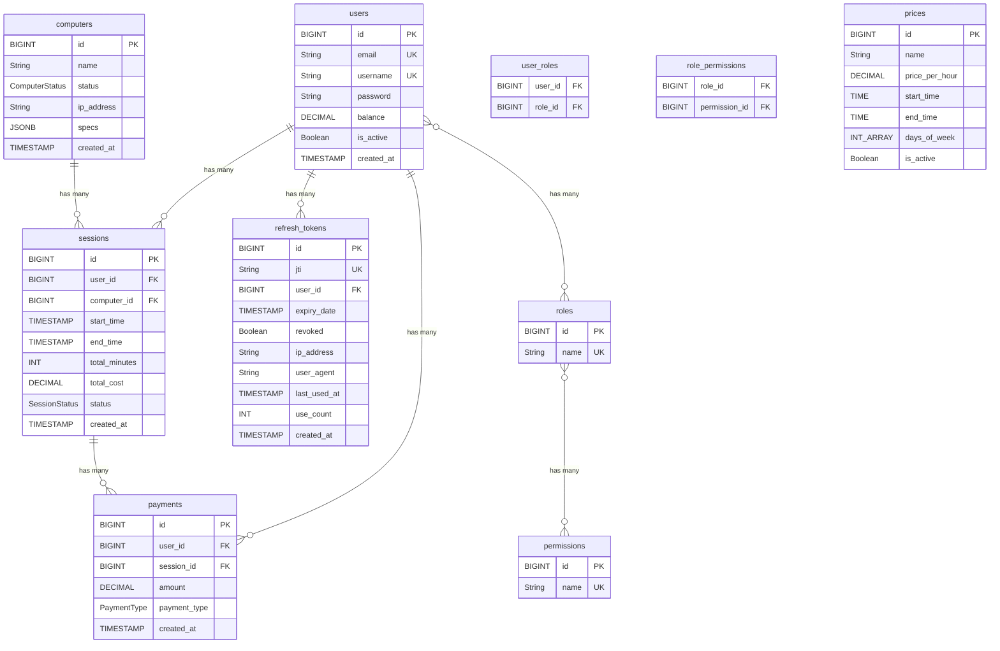

# Database Schema

## Entity Relationship Diagram

## Tables

### users
Main user table with authentication and balance information.

**Relationships:**
- One-to-Many with `sessions`
- One-to-Many with `payments`
- One-to-Many with `refresh_tokens`
- Many-to-Many with `roles` (via `user_roles`)

---

### roles
User roles for RBAC (Role-Based Access Control).

**Relationships:**
- Many-to-Many with `users` (via `user_roles`)
- Many-to-Many with `permissions` (via `role_permissions`)

---

### permissions
Fine-grained permissions for ABAC (Attribute-Based Access Control).

**Relationships:**
- Many-to-Many with `roles` (via `role_permissions`)

---

### sessions
Gaming sessions tracking user computer usage.

**Relationships:**
- Many-to-One with `users`
- Many-to-One with `computers`
- One-to-Many with `payments`

**Enums:**
- `SessionStatus`: ACTIVE, PAUSED, COMPLETED, CANCELLED

---

### computers
Available computers in the gaming cafe.

**Relationships:**
- One-to-Many with `sessions`

**Enums:**
- `ComputerStatus`: AVAILABLE, IN_USE, MAINTENANCE, OFFLINE

**Special Fields:**
- `specs`: JSONB field for flexible computer specifications

---

### payments
Payment transactions for sessions or balance top-ups.

**Relationships:**
- Many-to-One with `users`
- Many-to-One with `sessions` (optional - nullable for balance top-ups)

**Enums:**
- `PaymentType`: CASH, CARD, BALANCE, ONLINE

---

### prices
Dynamic pricing rules based on time and day of week.

**Special Fields:**
- `days_of_week`: Array of integers (1=Monday, 7=Sunday)
- `start_time`/`end_time`: Define time ranges for pricing

---

### refresh_tokens
JWT refresh tokens for authentication with security tracking.

**Relationships:**
- Many-to-One with `users`

**Security Features:**
- Token rotation with `use_count`
- IP and user agent tracking
- Revocation support

---

## Junction Tables

### user_roles
Maps users to their roles (Many-to-Many).

**Columns:**
- `user_id` (FK → users.id)
- `role_id` (FK → roles.id)

---

### role_permissions
Maps roles to their permissions (Many-to-Many).

**Columns:**
- `role_id` (FK → roles.id)
- `permission_id` (FK → permissions.id)
